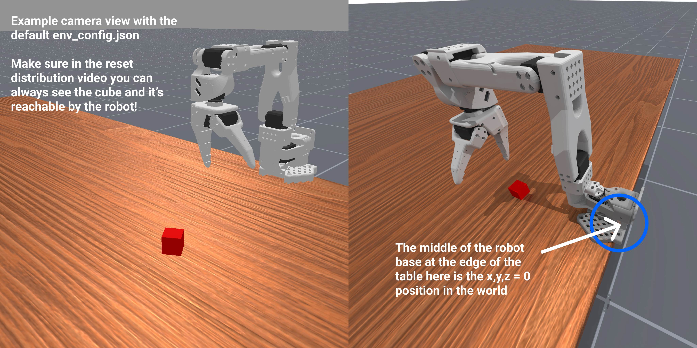
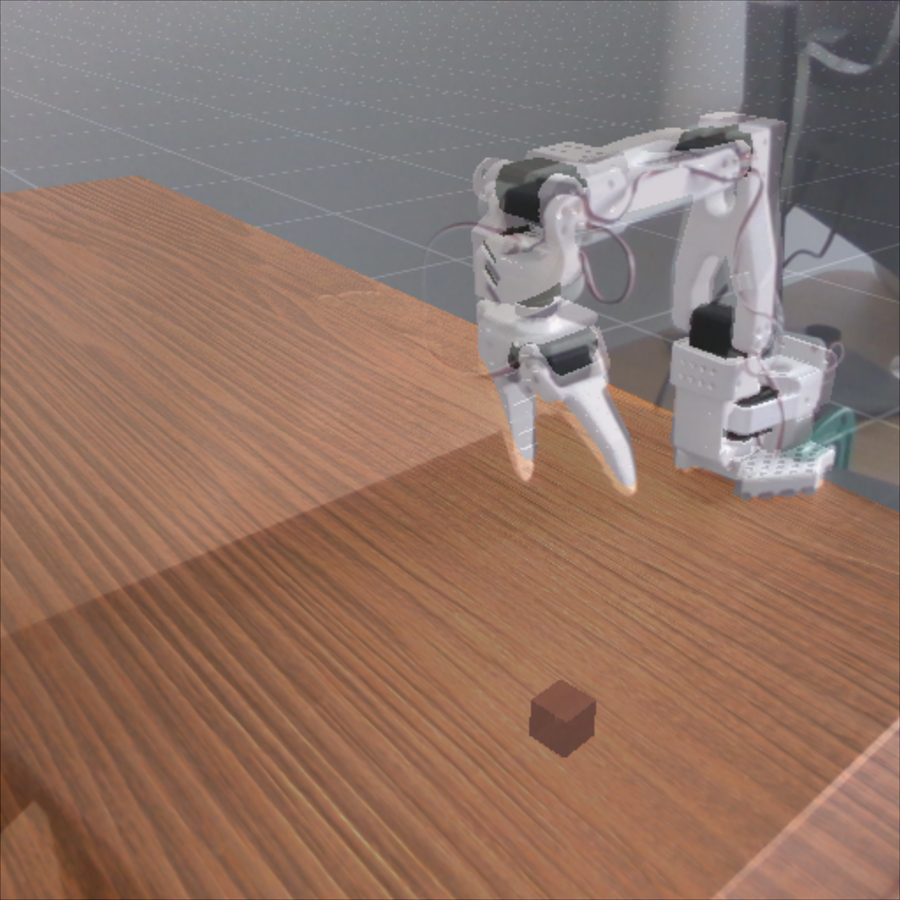
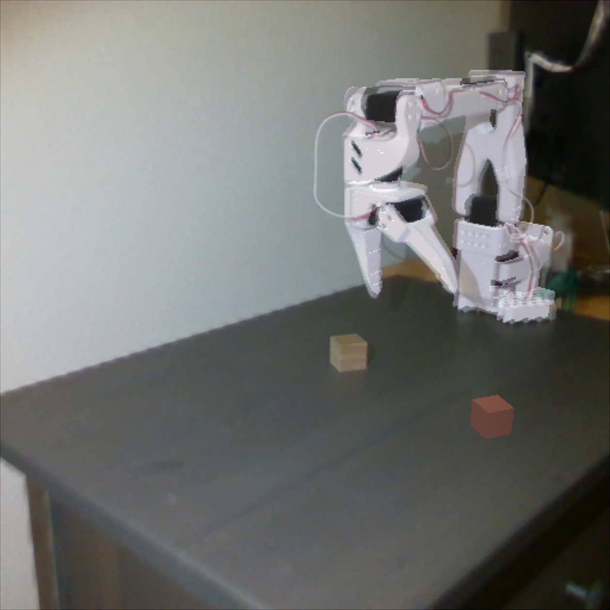

# Step-by-step Guide for Zero-Shot RGB Sim2Real Manipulation with LeRobot

Welcome to our tutorial on how to train a robot manipulation policy in simulation with Reinforcement Learning and deploy it zero-shot in the real world! This tutorial will take you through each step of a relatively simple approach for sim2real that does not rely on state estimation to perform sim2real, just RGB images. We will be using the SO100 / SO101 robot for this and [ManiSkill](https://github.com/haosulab/ManiSkill) for fast simulation and rendering. You will also need a camera and access to some NVIDIA GPU compute (with at least 8GB of GPU memory) for fast training (Google Colab works but might be a bit slow). This tutorial is simple and can be improved in many ways from better RL tuning and better reward functions, we welcome you to hack around with this repo!

If you find this project useful, give this repo and [ManiSkill](https://github.com/haosulab/ManiSkill) a star! If you are using [SO100](https://github.com/TheRobotStudio/SO-ARM100/)/[LeRobot](https://github.com/huggingface/lerobot), make sure to also give them a star. If you use ManiSkill / this sim2real codebase in your research, please cite our [research paper](https://arxiv.org/abs/2410.00425):

```
@article{taomaniskill3,
  title={ManiSkill3: GPU Parallelized Robotics Simulation and Rendering for Generalizable Embodied AI},
  author={Stone Tao and Fanbo Xiang and Arth Shukla and Yuzhe Qin and Xander Hinrichsen and Xiaodi Yuan and Chen Bao and Xinsong Lin and Yulin Liu and Tse-kai Chan and Yuan Gao and Xuanlin Li and Tongzhou Mu and Nan Xiao and Arnav Gurha and Viswesh Nagaswamy Rajesh and Yong Woo Choi and Yen-Ru Chen and Zhiao Huang and Roberto Calandra and Rui Chen and Shan Luo and Hao Su},
  journal = {Robotics: Science and Systems},
  year={2025},
}
```

This tutorial was written by [Xander Hinrichsen](https://www.linkedin.com/in/xander-hinrichsen/) and [Stone Tao](https://stoneztao.com/)

Note that whenever you see some command line/script, in this codebase you can always add `--help` to get more information and options.

## 0: Configure your LeRobot setup

First you should update the `lerobot_sim2real/config/real_robot.py` file to match your own configuration setup. You might need to change how the camera is setup and the ID of the robot. This allows the rest of the code to be able to control the real robot.

## 1: Setup your simulation and real world environment

We provide a pre-built [simulation environment called SO100GraspCube-v1](https://github.com/haosulab/ManiSkill/tree/main/mani_skill/envs/tasks/digital_twins/so100_arm/grasp_cube.py) that only needs a few minor modifications for your own use. If you are interested in making your own environments to then tackle via sim2real reinforcement learning we recommend you finish this tutorial first, then learn how to [create custom simulated tasks in ManiSkill](https://maniskill.readthedocs.io/en/latest/user_guide/tutorials/custom_tasks/index.html), then follow the tutorial on how to [design them for sim2real support](https://maniskill.readthedocs.io/en/latest/user_guide/tutorials/custom_tasks/index.html)

In this section we need to roughly align the real world and simulation environments. This means we need to decide where the robot is installed, and where the camera is relative to the robot. 

## 1.1: Setup simulation camera and object spawn region

First thing to do is to decide in simulation where to put the 3rd-view camera relative to the robot. The robot is always spawned at the 0 point of the simulation, at height "0" which is by default the top of the table surface you mount the robot on. This is what the default looks like in simulation and in the real world:



To make modifications you can just edit the "base_camera_settings"."pos" value in the `env_config.json` file in the root of the repository. We use this config file to modify environment defaults when training (you can pass in a different file path if you want). To visualize what you just did you can record a video of your environment being reset randomly to get a sense of where the camera is and see how the object positions are randomized.

```bash
python lerobot_sim2real/scripts/record_reset_distribution.py --env-id="SO100GraspCube-v1" --env-kwargs-json-path=env_config.json
```

https://github.com/user-attachments/assets/905c2c5c-6cf4-43a9-8cb8-fa40748fffef

You can also modify where the camera is pointing at in case it can't see the robot or enough of the workspace in simulation. Simply modify "base_camera_settings"."target" value accordingly, which is the 3D point the camera points at. Finally you can also modify the mean position cubes are spawned at as well as how large of a square area they are randomized in in the config file.

The default options for the sim settings are tested and should work so you can also skip modifying the simulation environment and go straight to setting up the real camera.

> [!NOTE]
> Occlusion can make grasping a cube harder. If you plan to modify the sim environment make sure the cube is always visible, close to the camera, and generally not behind the robot from the camera's perspective. If it isn't, you can modify the camera accordingly or also modify the spawn region for the cube in the env_config.json file. Moreover larger spawn region areas will take longer to learn to solve in simulation.


You might also notice that we often use `--env-id="SO100GraspCube-v1" --env-kwargs-json-path=env_config.json` in scripts. The codebase is built to support different environments and configurations so passing these tells those scripts which environment you want to work with and with what settings.

Before we start setting up the real camera you might also want to check if your robot's colors match the simulation one. The default is all white, but you can modify the color by changing the "robot_color" part of the `env_config.json` file to either be "random" or a value like [0.1, 0.1, 0.1] for black colored robots.

```json
  "domain_randomization_config": {
    "robot_color": "random"
  }
```

## 1.2: Roughly align the real world camera with the simulation camera

Next we need to roughly align the real world camera to match the position and orientation of the simulation one. To do so first mount your robot on a surface/table somewhere and make sure to mark down exactly where it is placed. Be prepared to unmount the robot later as we will need to take a picture of the background after camera alignment without the robot in the scene.

Then place the camera approximately where it is in simulation relative to the robot's base. The simulation always reports distances in meters. So if you define the position value of the camera to be `[0.7, 0.37, 0.28]`, try placing your real world camera at 0.7, 0.37 meters away (x/y axis or left/right/front/behind) and 0.28 meters above (z axis) the robot's base.

Next you can run the next script which will help you align the camera a bit. It will open a live window that overlays the simulation rendered image on top of the real world image. Your goal is to move and nudge the real world camera's position and orientation until you see the simulation and real world image overlay line up. Some cameras also have different intrinsics/fovs, while running this script you can also tune the field of view (FOV) value by pressing the left and right keys. This stage doesn't have to be perfectly done as we leverage domain randomization during RL training to support larger margins of error, but the closer the alignment the better.

```bash
python lerobot_sim2real/scripts/camera_alignment.py --env-id="SO100GraspCube-v1" --env-kwargs-json-path=env_config.json
```

Two examples are shown below, both of which after RL training worked out fine and produced working real world deployable models. Note that there are obvious errors here but that's fine!




## 1.3: Get an image for greenscreening to bridge the sim2real visual gap 

Once the camera looks well aligned, you need to take the robot off the surface/table and then take a picture of the background using the following script. It will save to a file `greenscreen.png`. If you can't unmount the robot, you can take the picture anyway and use photo editing tools or AI to remove the robot and inpaint the background.

```bash
python lerobot_sim2real/scripts/capture_background_image.py --env-id="SO100GraspCube-v1" --env-kwargs-json-path=env_config.json --out=greenscreen.png
```

Note that we still use the simulation environment here but primarily to determine how to crop the background image. If the sim camera resolution is 128x128 (the default) we crop the greenscreen image down to 128x128.

After capturing a greenscreen image mount the robot back to where it was originally. If you want to double check you can run the camera alignment script with the green screen image supplied and nudge the real robot mount location until it lines up. Simply
modify the env_config.json and add the path to the greenscreen image then run the camera alignment script again.

```bash
python lerobot_sim2real/scripts/camera_alignment.py --env-id="SO100GraspCube-v1" --env-kwargs-json-path=env_config.json
```

This will then produce something like below. Again it is not perfect alignment but this can still work!




## 2: Visual Reinforcement Learning in Simulation

Now we get to train the robot we setup in the real world in simulation via RL. We provide a baseline training script for visual Proximal Policy Optimization (PPO), which accepts environment id and the env configuration json file so that we can train on an environment aligned with the real world.

For the SO100GraspCube-v1 environment we have the following already tuned script (uses about 8-10GB of GPU memory)

```bash
seed=42
python lerobot_sim2real/scripts/train_ppo_rgb.py --env-id="SO100GraspCube-v1" --env-kwargs-json-path=env_config.json \
  --ppo.seed=${seed} \
  --ppo.num_envs=1024 --ppo.num-steps=16 --ppo.update_epochs=8 --ppo.num_minibatches=32 \
  --ppo.total_timesteps=100_000_000 --ppo.gamma=0.9 \
  --ppo.num_eval_envs=16 --ppo.num-eval-steps=64 --ppo.no-partial-reset \
  --ppo.exp-name="ppo-SO100GraspCube-v1-rgb-${seed}" \
  --ppo.track --ppo.wandb_project_name "SO100-ManiSkill"
```

This will train an agent via RL/PPO and track its training progress on Weights and Biases and Tensorboard. Run `tensorboard --logdir runs/` to see the local tracking. Checkpoints are saved to `runs/ppo-SO100GraspCube-v1-rgb-${seed}/ckpt_x.pt` and evaluation videos in simulation are saved to `runs/ppo-SO100GraspCube-v1-rgb-${seed}/videos`. If you have more GPU memory available you can train faster by bumping the `--ppo.num_envs` argument up to 2048.

For this environment the evaluation result curves may look approximately like this.


For the SO100GraspCube-v1 task you don't need 100_000_000 timesteps of training for successful deployment. We find that around 25 to 40 million are enough, which take about an hour of training on a 4090 GPU. Over training can sometimes lead to worse policies! Generally make sure first your policy reaches a high evaluation success rate in simulation before considering taking a checkpoint and deploying it.


## 3: Real World Deployment

Now you have a checkpoint you have trained and want to evaluate, place a cube onto the table in front of the robot. We recommend using cubes around 2.5cm in size since that is the average size the robot is trained to pick up in simulation. Furthermore we strongly recommend to be wary that you place the cube in a location that the robot was trained to pick from, which is dependent on your cube spawning randomization settings (if you aren't sure check the reset distribution video you generated in step 1).

Then you run your model on the real robot with the following. Note that each time the real environment needs to be reset you will be prompted in the terminal to do so and to press enter to start the next evaluation episode.

```bash
python lerobot_sim2real/scripts/eval_ppo_rgb.py --env_id="SO100GraspCube-v1" --env-kwargs-json-path=env_config.json \
    --checkpoint=path/to/ckpt.pt --no-continuous-eval --control-freq=15
```

For safety reasons we recommend you run the script above with --no-continuous_eval first, which forces the robot to wait for you to press enter into the command line before it takes each action. Sometimes RL can learn very strange behaviors and in the real world this can lead to dangerous movements or the robot breaking. If you are okay with more risk and/or have checked that the robot is probably going to take normal actions you can remove the argument to allow the RL agent to run freely. We further recommend for the SO100 hardware to stick to a control frequency of 15 which is a good balance of speed with accuracy/safety. Finally when running the script always be prepared to press `ctrl+c` on your keyboard, which will gracefully stop the script and return the robot to a rest position + disable torque. Make sure to be aware of if the robot is pressing an object/table too hard as it can break something.

Moreover you may want to check a few checkpoints that achieve high simulation evaluation success rate. Sometimes RL will learn something that does not generalize well to the real world, so some checkpoints might do better than others despite having the same performance in simulation. Grasping a cube is a fairly precise problem in many ways.

If all things go well, you can now get a rather fast autonomous cube picking policy like below!

https://github.com/user-attachments/assets/ca20d10e-d722-48fe-94af-f57e0b2b2fcd

## Frequently Asked Questions / Problems

As people report some common questions/problems, ways to address them will be populated here!

- **RL is not learning in 25-40 million timesteps**: There are many reasons why RL can fail. For one the default reward function provided is very simple, it is effectively about 5 lines of code. Moreover the default training script was tuned to keep GPU memory usage on the lower end to ensure older GPUs can run training as well. One way to stabilize RL training further is to increase training batch-size and number of parallel environments. You can try doubling the number of environments (use 2048) first and see how it goes. Another reason for RL to fail is if the camera positioning in simulation is hard to learn from. Some setups can make occlusions occur more often than not which makes the problem impossible without more advanced methods. Finally you can also try running with another seed for training.

- **Policy learns to reach and grasp the cube but tends to drop the cube later**: By default the eval script gives the robot 100 time steps (100 / control_freq seconds) of time to solve the task. At the end of that time the robot is commanded to go to a rest position which releases the gripper. If the robot is often releasing the cube way before the time and failing the task, one reason is the checkpoint you are using may not have trained long enough. It is possible that the checkpoint can get a high success rate in simulation but fail in the real world due to some differences in the calibration of the real robot and simulated robot. More training can often help make this a bit more robust. Another suggestion is to try another robot and/or try re-calibrating your robot, poor calibration/hardware issues can increase the sim2real gap and make performance worse.

- **Policy has low success rate, fails to grasp the cube**: In general even with poor calibration the policy should at least learn to reach the cube / push it around. Grasping the cube is harder and requires more accuracy. Beyond just calibration issues / following the suggestions above, you should also make sure you are placing the cube in a location that the robot has seen during training, namely the spawn area. If you aren't sure double check the reset distribution video you generated earlier to get a sense of how far cubes can be placed before it becomes out of distribution data.
